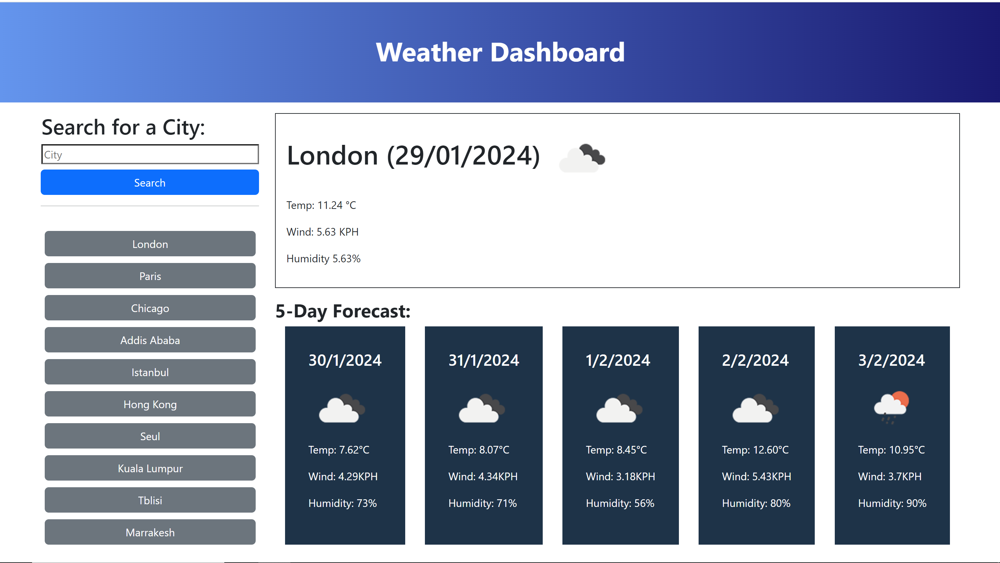

# Weather Dashboard

## Description
This web application has been created for travellers to see the weather outlook for multiple cities and plan a trip accordingly The app can be reach through this <a href="https://hazalsigic.github.io/weather-dashboard/" target="_blank">link</a>.

## Installation
N/A

## Visuals

## Usage
Users can enter the name of the city they are planing to visit to display the current weather as well as the next five-day forecast. Search history ease the process for users to go back to the weather forecast they have checked before. 

## Contributing
N/A

## License
Please refer to the LICENCE in the repo.